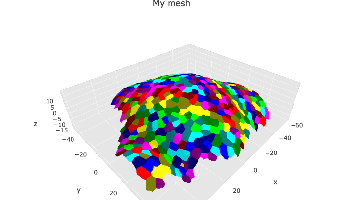
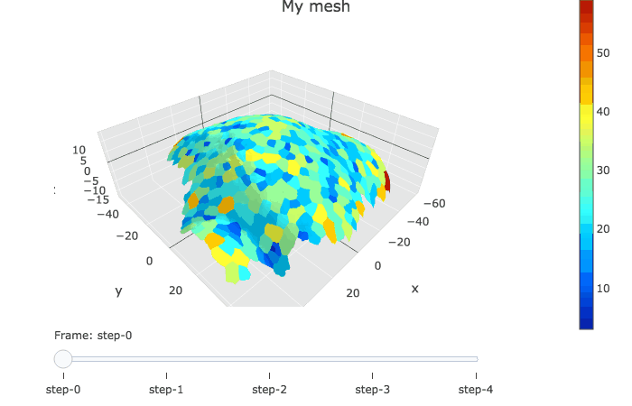

```{r setup, include = FALSE}
knitr::opts_chunk$set(
  collapse = TRUE,
  comment = "#>"
)
```


## Visualisation of a single mesh

The data in the example below were created with the package {mgx2r}, on the example dataset of {mgx2r}. This dataset is a timelapse recording of the development of a shoot apical meristem of the plant \emph{Arabidopsis thaliana} expressing a membrane marker. I took one 3D stack every 12h and have 5 timepoints in total. To know more about the example dataset of {mgx2r}, see the readme of [{mgx2r}](https://github.com/marionlouveaux/mgx2r). 

```{r, eval=FALSE}
myMesh <- readRDS(system.file("extdata",
                              "mgx/mesh_meristem_full_T0.rds",
                              package = "cellviz3d"))

myCellGraph <- readRDS(system.file("extdata",
                                   "mgx/cellGraph_meristem_full_T0.rds",
                                   package = "cellviz3d"))
```

`plotlyMesh()` creates a {plotly} graph of type mesh 3D, with custom colors and custom hover information for a single mesh. Below, the mesh is displayed with one color and one cell label per biological cell. Cell label is visible only when hovering over the cell center. `plotlyMesh()` can be combined with `show_tensors()` and/or `show_cellcontour()`.


```{r, eval=FALSE}
meshCellcenter <- myCellGraph$vertices[,c("label","x", "y", "z")]

plotlyMesh(meshExample = myMesh,
           meshColors = myMesh$allColors$Col_label,
           meshCellcenter = meshCellcenter) %>%
  layout(scene = list(aspectmode = "data"))
```


```{r echo=FALSE}
silent <- file.copy(
  system.file("extdata", "mgx/img/p1labels.png", package = "cellviz3d"),
  "p1labels.png")

```

## Visualisation of a time serie

The data in the example below were created with the package {mgx2r}, on the example dataset of {mgx2r}. This dataset is a timelapse recording of the development of a shoot apical meristem of the plant \emph{Arabidopsis thaliana} expressing a membrane marker. I took one 3D stack every 12h and have 5 timepoints in total. To know more about the example dataset of {mgx2r}, see the readme of [{mgx2r}](https://github.com/marionlouveaux/mgx2r).

```{r, eval=FALSE}
mesh.all <- readRDS(system.file("extdata",
                              "mgx/mesh_meristem_full_all.rds",
                              package = "cellviz3d"))

cellGraph.all <- readRDS(system.file("extdata",
                                   "mgx/cellGraph_meristem_full_all.rds",
                                   package = "cellviz3d"))
```

`plotlyMesh_all()` creates a plotly graph of type mesh 3D with a slider for a serie of meshes.

```{r, warning = FALSE, message = FALSE, eval=FALSE}
meshColors.all <- list(NULL, NULL, NULL, NULL, NULL)

plotlyMesh_all(meshExample = mesh.all,
                       graphExample = cellGraph.all,
                       meshColors = meshColors.all,
                       display = 'heatmap')

```

```{r echo=FALSE}
silent <- file.copy(
  system.file("extdata", "mgx/img/timeserie800ms.gif", package = "cellviz3d"),
  "timeserie800ms.gif")

```


For more examples, see the vignette of the [{mgx2r}](https://github.com/marionlouveaux/mgx2r) package:

```{r eval=FALSE}
devtools::install_github("marionlouveaux/mgx2r", build_vignettes = TRUE)
vignette("vignette_basics", package = "mgx2r")
vignette("vignette_time_series", package = "mgx2r")
```


